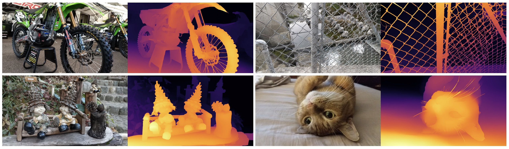

# [CVPR 2022] Practical Stereo Matching via Cascaded Recurrent Network with Adaptive Correlation


This repository contains [MegEngine](https://github.com/MegEngine/MegEngine) implementation of our paper: 

> **Practical Stereo Matching via Cascaded Recurrent Network with Adaptive Correlation**\
> Jiankun Li, Peisen Wang, Pengfei Xiong, Tao Cai, Ziwei Yan, Lei Yang, Jiangyu Liu, Haoqiang Fan, Shuaicheng Liu \
> CVPR 2022 **(Oral)**

**[Paper](https://openaccess.thecvf.com/content/CVPR2022/papers/Li_Practical_Stereo_Matching_via_Cascaded_Recurrent_Network_With_Adaptive_Correlation_CVPR_2022_paper.pdf)  | [ArXiv](https://arxiv.org/abs/2203.11483) | [BibTeX](#citation)** 



## Datasets

### The Proposed Dataset

#### Download

There are **two ways** to download the dataset(~400GB) proposed in our paper: 

- Download using shell scripts `dataset_download.sh`

```shell
sh dataset_download.sh
```

the dataset will be downloaded and extracted in `./stereo_trainset/crestereo`

 - Download from BaiduCloud [here](https://pan.baidu.com/s/1iB96-ftCgPFTlrj220qw8Q)(Extraction code: `aa3g`) and extract the tar files manually.

#### Disparity Format

The disparity is saved as `.png` uint16 format which can be loaded using opencv `imread` function:

```python
def get_disp(disp_path):
    disp = cv2.imread(disp_path, cv2.IMREAD_UNCHANGED)
    return disp.astype(np.float32) / 32
```

### Other Public Datasets

Other public datasets we use including 

 - [SceneFlow](https://lmb.informatik.uni-freiburg.de/resources/datasets/SceneFlowDatasets.en.html)
 - [Sintel](http://sintel.is.tue.mpg.de/stereo)
 - [Middlebury](https://vision.middlebury.edu/stereo/data/)
 - [ETH3D](https://www.eth3d.net/datasets#low-res-two-view-training-data)
 - [KITTI 2012/2015](http://www.cvlibs.net/datasets/kitti/eval_stereo.php) 
 - [Falling Things](https://research.nvidia.com/publication/2018-06_Falling-Things)
 - [InStereo2K](https://github.com/YuhuaXu/StereoDataset)
 - [HR-VS](https://drive.google.com/file/d/1SgEIrH_IQTKJOToUwR1rx4-237sThUqX/view)


 ## Dependencies


CUDA Version: 10.1, Python Version: 3.6.9


 - MegEngine v1.8.2
 - opencv-python  v3.4.0
 - numpy  v1.18.1
 - Pillow  v8.4.0
 - tensorboardX  v2.1

```bash
python3 -m pip install -r requirements.txt
```

We also provide docker to run the code quickly:
```bash
docker run --gpus all -it -v /tmp:/tmp ylmegvii/crestereo
shotwell /tmp/disparity.png
```

 ## Inference

Download the pretrained MegEngine model from [here](https://drive.google.com/file/d/1Wx_-zDQh7BUFBmN9im_26DFpnf3AkXj4/view) and run:

```shell
python3 test.py --model_path path_to_mge_model --left img/test/left.png --right img/test/right.png --size 1024x1536 --output disparity.png
```


 ## Training

Modify the configurations in `cfgs/train.yaml` and run the following command:

```shell
python3 train.py
```

You can launch a TensorBoard to monitor the training process:

```shell
tensorboard --logdir ./train_log
```

and navigate to the page at `http://localhost:6006` in your browser.


## Acknowledgements
Part of the code is adapted from previous works: 
 - [RAFT](https://github.com/princeton-vl/RAFT)(code base)
 - [LoFTR](https://github.com/zju3dv/LoFTR)(attention module)
 - [HSMNet](https://github.com/gengshan-y/high-res-stereo)(data augmentaion)

We thank all the authors for their awesome repos.


## Citation
If you find the code or datasets helpful in your research, please cite:

```
@inproceedings{li2022practical,
  title={Practical stereo matching via cascaded recurrent network with adaptive correlation},
  author={Li, Jiankun and Wang, Peisen and Xiong, Pengfei and Cai, Tao and Yan, Ziwei and Yang, Lei and Liu, Jiangyu and Fan, Haoqiang and Liu, Shuaicheng},
  booktitle={Proceedings of the IEEE/CVF Conference on Computer Vision and Pattern Recognition},
  pages={16263--16272},
  year={2022}
}
```
